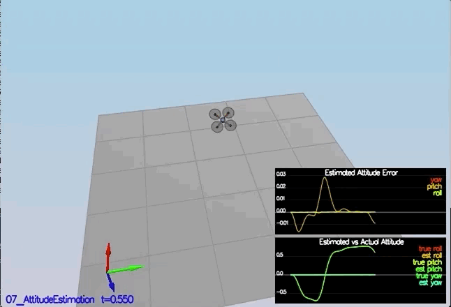

# Project: Building An Estimator
Junqiang Zhou

---
  |  
:-------------------------:|:-------------------------:
<center> Fig. Schematic diagram of drone <center>
---

### Step 1: Sensor Noise  ###
Load the data from 'Graph1.txt' and 'Graph2.txt', and calculate their standard deviation which gives
- `Quad.GPS.X std  = 0.71`
- `Quad.IMU.AX std = 0.51`

Run scenario `06_SensorNoise`


### Step 2: Attitude Estimation ###
Implement the nonlinear complementary filter:
- The Euler angle update is calculated by first converting into quaternion, integrating the body rate in the body frame, and converting the predicted quaternion back to Euler angle.
- Run scenario `07_AttitudeEstimation`



### Step 3: Prediction Step ###

1. In `QuadEstimatorEKF.cpp`, implement the state prediction step in the `PredictState()` functon. Run scenario `08_PredictState`.


2. In `QuadEstimatorEKF.cpp`, calculate the partial derivative of the body-to-global rotation matrix in the function `GetRbgPrime()`. Run scenario `09_PredictionCov`.


### Step 4: Magnetometer Update ###
1. Tune the parameter `QYawStd` (`QuadEstimatorEKF.txt`) for the QuadEstimatorEKF
2. Implement magnetometer update in the function `UpdateFromMag()`.
3. Run scenario `10_MagUpdate`.


### Step 5: Closed Loop + GPS Update ###
1. Use realistic IMU by changing `config/11_GPSUpdate.txt`:
```
Quad.UseIdealEstimator = 0
#SimIMU.AccelStd = 0,0,0
#SimIMU.GyroStd = 0,0,0
```
2. Tune the process noise model in `QuadEstimatorEKF.txt` to try to approximately capture the error you see with the estimated uncertainty (standard deviation) of the filter.

3. Implement the EKF GPS Update in the function `UpdateFromGPS()`.

4. Run scenario `11_GPSUpdate`


### Step 6: Adding Your Controller ###
1. Replace `QuadController.cpp` with the controller you wrote in the last project.
2. Replace `QuadControlParams.txt` with the control parameters you came up with in the last project.
3. Run scenario `11_GPSUpdate`


### Rubric Points
1. Implement `UpdateFromIMU()`. (Nonlinear complementary filter-based attitude estimation)

See implementation in C++ at line 101-110 in `src\QuadEstimatorEKF.cpp`

2. Implement `PredictState()`. (EKF predicted state update)

See implementation in C++ at line 171-180 in `src\QuadEstimatorEKF.cpp`

3. Implement `GetRbgPrime()`. (Calculate partial of rotation matrix w.r.t. yaw)

See implementation in C++ at line 204-212 in `src\QuadEstimatorEKF.cpp`

4. Implement `Predict()`. (EKF estimated state and covariance matrix update)

See implementation in C++ at line 255-265 in `src\QuadEstimatorEKF.cpp`

5. Implement `UpdateFromGPS()`. (GPS estimation update)

See implementation in C++ at line 287-294 in `src\QuadEstimatorEKF.cpp`

6. Implement `UpdateFromMag()`. (Magnetometer estimation update)

See implementation in C++ at line 313-324 in `src\QuadEstimatorEKF.cpp`

7. Re-tune estimator Parameters.

See tuned parameters in `config\QuadEstimatorEKF.txt`

8. Re-tune controller Parameters.

See controller implementation in `src\QuadControl.cpp` and tuned parameters in `config\QuadControlParams.txt`
